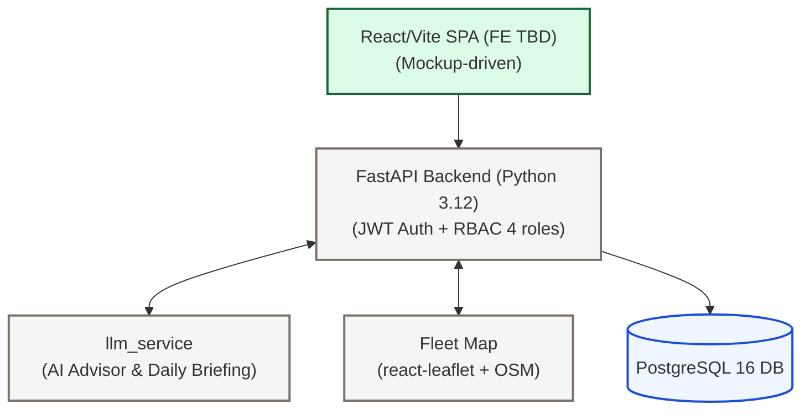

# TransitOps 🚛

**Smart Transport Operations Platform** — Hackathon Project (Odoo Hackathon, 6–7 hrs, 3-person team)

> Centralized platform for managing vehicle fleets, drivers, dispatching, maintenance, fuel, analytics — plus GenAI differentiators.

---

## Documentation Index

| Document | Description |
|---|---|
| [System Architecture](./docs/system_architecture.md) | Tech stack, GenAI architecture, component map, RBAC, Docker, cut list |
| [Database Schema](./docs/database_schema.md) | All tables (P0 + P1), enums, views, indexes, migration strategy |
| [API Design](./docs/api_design.md) | All endpoints incl. P1 AI + map, P2 chat, P3 autopilot |
| [Implementation Plan](./docs/implementation_plan.md) | Team split, phase-by-phase plan with code patterns, demo script |
| [Business Rules](./docs/business_rules.md) | All 12 business rules, state machines, error messages |

---

## Quick Start

```bash
# Clone and set up environment
cp .env.example .env

# Start the stack
docker compose up --build

# Run migrations + seed
docker compose exec api alembic upgrade head
docker compose exec api python -m app.db.init_db

# API docs available at:
open http://localhost:8000/docs
```

---

## Architecture Summary



**8 core + 3 P1 DB entities** · **12 enforced business rules** · **3 PostgreSQL views** · **P0–P3 endpoint tiers**

---

## Build Priority

| Priority | Features |
|---|---|
| **P0 — Mandatory** | Auth, Vehicles, Drivers, Trips, Maintenance, Fuel/Expense, Dashboard, Reports |
| **P1 — Differentiator** | Live Fleet Map, AI Dispatch Advisor, AI Daily Ops Briefing |
| **P2 — Stretch** | "Ask TransitOps" chat widget (if ahead of schedule) |
| **P3 — Moonshot** | Control Tower — Autonomous Dispatch (only if P0+P1 fully stable) |

> **Rule:** Do not start P2 or P3 until every P0 and P1 item is functional and demo-ready.

---

## Roles

| Role | Primary Responsibilities |
|---|---|
| `fleet_manager` | Full access — fleet assets, maintenance, lifecycle |
| `dispatcher` | Create/dispatch trips, log fuel & expenses, use AI Suggest |
| `safety_officer` | Driver compliance, license tracking, maintenance |
| `financial_analyst` | Read-only reports, expense tracking, exports |

---

## Key Business Rules (P0)

1. Vehicle registration numbers are globally unique
2. `Retired` / `In Shop` vehicles never appear in dispatch selection
3. Drivers with expired licenses or `Suspended` status cannot be assigned
4. A vehicle/driver already `On Trip` cannot be assigned to another trip
5. Cargo weight is validated against vehicle max load capacity
6. Dispatching a trip atomically sets vehicle + driver → `On Trip`
7. Completing a trip atomically restores vehicle + driver → `Available`
8. Cancelling a dispatched trip restores vehicle + driver → `Available`
9. Creating a maintenance record automatically sets vehicle → `In Shop`
10. Closing maintenance restores vehicle → `Available` (unless `Retired`)

---

## GenAI Features (P1)

All three AI features share **one `llm_service` wrapper** — build once, reuse everywhere:

- **AI Dispatch Advisor** (`POST /trips/suggest`) — ranks eligible vehicle+driver pairs with natural-language reasoning. Eligibility filtering always happens in `trip_service` first; LLM only ranks and explains.
- **AI Daily Ops Briefing** (`POST /dashboard/briefing`) — 3–4 sentence fleet narrative from current KPIs, flagged items, cost spikes. Cached for 5 min to avoid regenerating on every page load.
- **Live Fleet Map** (`GET /fleet/locations`) — `react-leaflet` + OpenStreetMap. Vehicles colour-coded by status. Static depot lat/lng lookup — no geocoding API needed.

**Fallback:** each AI endpoint has a pre-generated hardcoded response against seed data. LLM failure during judging falls back silently — no UI hang.

---

## Explicit Cut List

Features deliberately excluded from this build:
- ❌ Real GPS / live vehicle telemetry
- ❌ Real routing or geocoding API (static depot table used instead)
- ❌ Predictive maintenance ML model
- ❌ RAG / vector DB (direct context-stuffing only for P2 chat)
- ❌ PDF export (CSV is the mandatory deliverable)
- ❌ Email reminders (APScheduler log-only is sufficient)
- ❌ P3 Control Tower — only if P0 + P1 fully stable with time remaining
