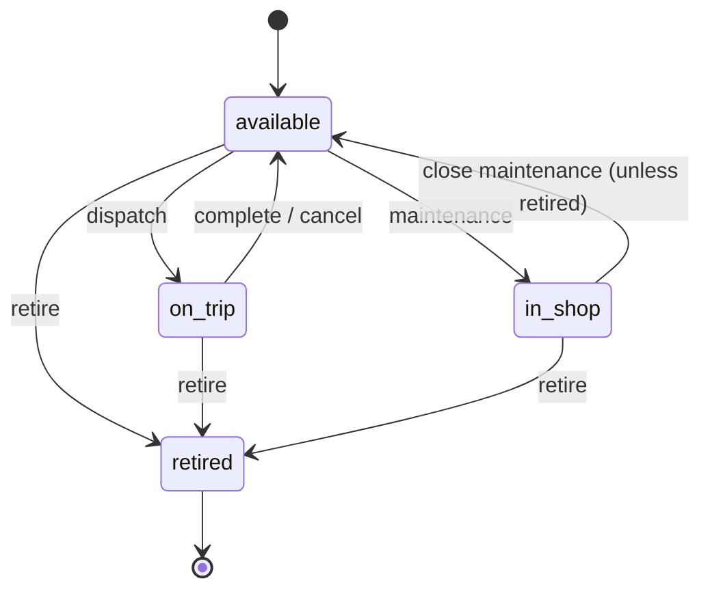
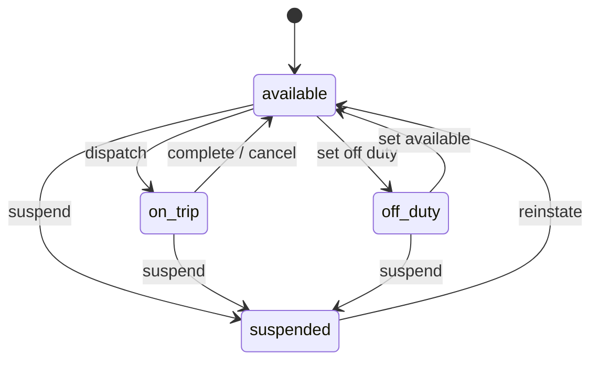
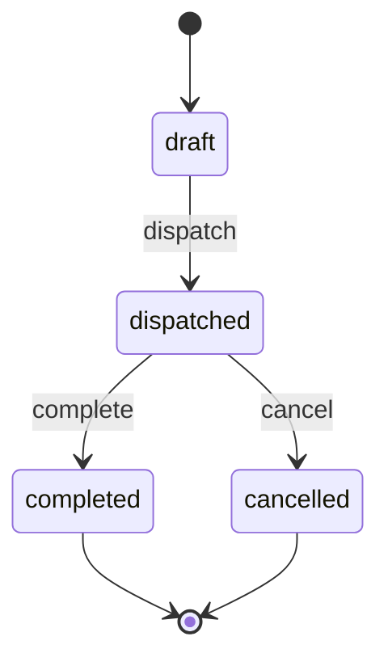

# TransitOps — Business Rules Reference

> This document is the **single source of truth** for all business rules.  
> Every rule maps to a specific enforcement point in the codebase.

---

## Status Enums

### Vehicle Status
| Value | Meaning |
|---|---|
| `available` | Ready to be dispatched |
| `on_trip` | Currently on an active trip |
| `in_shop` | Under maintenance |
| `retired` | Permanently decommissioned |

### Driver Status
| Value | Meaning |
|---|---|
| `available` | Ready to be assigned |
| `on_trip` | Currently driving an active trip |
| `off_duty` | Temporarily not working |
| `suspended` | Cannot be assigned to any trip |

### Trip Status
| Value | Meaning |
|---|---|
| `draft` | Created but not dispatched |
| `dispatched` | Active, in-progress |
| `completed` | Successfully finished |
| `cancelled` | Aborted |

### Maintenance Status
| Value | Meaning |
|---|---|
| `open` | Vehicle currently in shop |
| `closed` | Work completed |

---

## State Machines

### Vehicle FSM


### Driver FSM


### Trip FSM


---

## Business Rules (Numbered for Reference)

### BR-01: Unique Vehicle Registration Number
- **Rule:** No two vehicles may share the same `registration_number`.
- **Enforcement:** `UNIQUE` constraint on DB + `HTTP 409` on duplicate.
- **Location:** `models/vehicle.py` (DB), `api/v1/vehicles.py` (HTTP).

---

### BR-02: Dispatch — Vehicle Must Be Available
- **Rule:** A vehicle with status `on_trip`, `in_shop`, or `retired` cannot be selected for a new trip dispatch.
- **Enforcement:** `trip_service.dispatch_trip()` checks `vehicle.status == 'available'`.
- **Error:** `HTTP 400 — "Vehicle is not available for dispatch (status: on_trip)"`

---

### BR-03: Dispatch — Driver Must Be Available
- **Rule:** A driver with status `on_trip`, `off_duty`, or `suspended` cannot be assigned to a trip.
- **Enforcement:** `trip_service.dispatch_trip()` checks `driver.status == 'available'`.
- **Error:** `HTTP 400 — "Driver is not available (status: suspended)"`

---

### BR-04: Dispatch — Driver License Must Not Be Expired
- **Rule:** `driver.license_expiry >= today()` at the time of dispatch.
- **Enforcement:** `trip_service.dispatch_trip()` compares `driver.license_expiry` to `date.today()`.
- **Error:** `HTTP 400 — "Driver license expired on 2025-03-15"`

---

### BR-05: Dispatch — Cargo Weight Must Not Exceed Vehicle Capacity
- **Rule:** `trip.cargo_weight_kg <= vehicle.max_load_kg`.
- **Enforcement:** `trip_service.dispatch_trip()` (or Pydantic validator on trip creation).
- **Error:** `HTTP 400 — "Cargo 520 kg exceeds vehicle max load 500 kg"`

---

### BR-06: Dispatch Side Effects
- **Rule:** Dispatching a trip atomically sets:
  - `trip.status → dispatched`
  - `trip.dispatched_at → now()`
  - `vehicle.status → on_trip`
  - `driver.status → on_trip`
- **Enforcement:** `trip_service.dispatch_trip()` — all updates in single `db.commit()`.
- **Atomicity:** If any update fails, the transaction rolls back entirely.

---

### BR-07: Complete Trip Side Effects
- **Rule:** Completing a trip atomically sets:
  - `trip.status → completed`
  - `trip.completed_at → now()`
  - `trip.actual_distance_km → provided value`
  - `vehicle.odometer_km → provided final_odometer_km`
  - `vehicle.status → available`
  - `driver.status → available`
- **Enforcement:** `trip_service.complete_trip()`.

---

### BR-08: Cancel Trip Side Effects
- **Rule:** Cancelling a dispatched trip atomically sets:
  - `trip.status → cancelled`
  - `trip.cancelled_at → now()`
  - `vehicle.status → available`
  - `driver.status → available`
- **Note:** Draft trips can be deleted directly without status restoration (no statuses changed).
- **Enforcement:** `trip_service.cancel_trip()`.

---

### BR-09: Maintenance — Automatic In Shop
- **Rule:** Creating a `maintenance_log` with `status = 'open'` automatically sets `vehicle.status → in_shop`.
- **Enforcement:** `maintenance_service.create_maintenance()` — sets vehicle status in same transaction.
- **Cascade:** Vehicle disappears from `/vehicles/available` endpoint and dispatch dropdowns.

---

### BR-10: Maintenance Close — Restore Vehicle
- **Rule:** Closing a maintenance record (`status → closed`) sets `vehicle.status → available`, **unless** the vehicle is `retired`.
- **Enforcement:** `maintenance_service.close_maintenance()` — checks `vehicle.status != 'retired'` before restoring.

---

### BR-11: Retired Vehicle Is Permanent
- **Rule:** A retired vehicle cannot be dispatched, and closing its maintenance record does NOT restore it to `available`.
- **Enforcement:**
  - BR-02 already blocks dispatch.
  - BR-10 checks `retired` before restoration.

---

### BR-12: Duplicate Assignment Prevention
- **Rule:** A driver or vehicle already `on_trip` cannot be assigned to another trip (enforced at dispatch, not at draft creation).
- **Enforcement:** BR-02 and BR-03 in `dispatch_trip()`.
- **Note:** Draft trips are allowed to reference on-trip vehicles/drivers as a staging mechanism, but dispatch is blocked.

---

## Validation Responsibilities

| Rule | DB Layer | Service Layer | Pydantic |
|---|:---:|:---:|:---:|
| Unique registration number | ✅ UNIQUE | — | — |
| Cargo ≤ max load | — | ✅ | ✅ |
| License not expired | — | ✅ | — |
| Vehicle available | — | ✅ | — |
| Driver available | — | ✅ | — |
| Status transitions | — | ✅ | — |
| Positive cargo weight | CHECK > 0 | — | ✅ |
| Cost > 0 | CHECK > 0 | — | ✅ |

---

## Error Messages (Standardized)

All errors follow this JSON structure:
```json
{ "detail": "Human-readable error message" }
```

| Rule | Message Template |
|---|---|
| BR-02 | `"Vehicle {reg} is not available for dispatch (current status: {status})"` |
| BR-03 | `"Driver {name} cannot be assigned (current status: {status})"` |
| BR-04 | `"Driver {name} license expired on {date}"` |
| BR-05 | `"Cargo {weight} kg exceeds vehicle max capacity {max} kg"` |
| BR-01 | `"Vehicle with registration '{reg}' already exists"` |
| BR-09 | `"Vehicle {reg} status changed to 'in_shop' automatically"` (info) |

---

## Scheduler Rules (Bonus)

### License Expiry Alerts
- **Trigger:** Daily at 08:00 UTC
- **Condition:** `driver.license_expiry BETWEEN today AND today + 30 days`
- **Action:** Log warning + (optional) send email notification
- **Implementation:** APScheduler job in `app/scheduler.py`

```python
from apscheduler.schedulers.asyncio import AsyncIOScheduler

scheduler = AsyncIOScheduler()

@scheduler.scheduled_job("cron", hour=8, minute=0)
async def check_expiring_licenses():
    async with get_db_context() as db:
        expiring = await db.execute(
            select(Driver).where(
                Driver.license_expiry.between(date.today(), date.today() + timedelta(days=30))
            )
        )
        for driver in expiring.scalars():
            logger.warning(f"License expiring: {driver.full_name} — {driver.license_expiry}")
```
