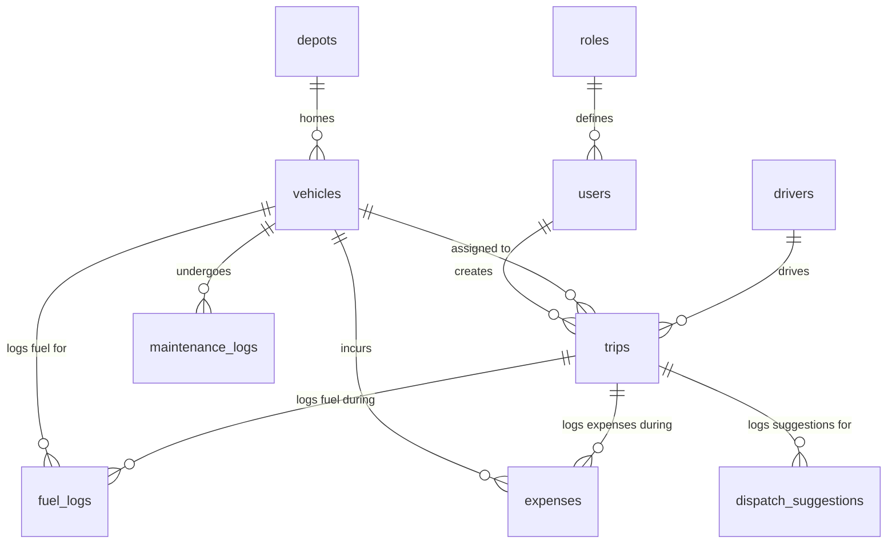

# TransitOps — Database Schema

## Entity Relationship Overview



---

## Tables

### `roles`
Lookup table — seeded at startup.

| Column | Type | Constraints |
|---|---|---|
| `id` | `SMALLINT` | PK |
| `name` | `VARCHAR(30)` | UNIQUE NOT NULL |

**Seed values:** `fleet_manager`, `dispatcher`, `safety_officer`, `financial_analyst`

---

### `users`

| Column | Type | Constraints |
|---|---|---|
| `id` | `UUID` | PK DEFAULT gen_random_uuid() |
| `full_name` | `VARCHAR(100)` | NOT NULL |
| `email` | `VARCHAR(255)` | UNIQUE NOT NULL |
| `hashed_password` | `VARCHAR(255)` | NOT NULL |
| `role_id` | `SMALLINT` | FK → roles.id NOT NULL |
| `is_active` | `BOOLEAN` | DEFAULT TRUE |
| `created_at` | `TIMESTAMPTZ` | DEFAULT now() |

---

### `vehicles`

| Column | Type | Constraints |
|---|---|---|
| `id` | `UUID` | PK DEFAULT gen_random_uuid() |
| `registration_number` | `VARCHAR(20)` | UNIQUE NOT NULL |
| `name` | `VARCHAR(100)` | NOT NULL |
| `type` | `VARCHAR(50)` | NOT NULL (e.g. Van, Truck, Bike) |
| `max_load_kg` | `NUMERIC(10,2)` | NOT NULL CHECK > 0 |
| `odometer_km` | `NUMERIC(10,2)` | NOT NULL DEFAULT 0 |
| `acquisition_cost` | `NUMERIC(12,2)` | NOT NULL DEFAULT 0 |
| `status` | `vehicle_status` ENUM | NOT NULL DEFAULT 'available' |
| `region` | `VARCHAR(100)` | NULLABLE |
| `lat` | `NUMERIC(9,6)` | NULLABLE — *P1: current location latitude* |
| `lng` | `NUMERIC(9,6)` | NULLABLE — *P1: current location longitude* |
| `depot_id` | `UUID` | FK → depots.id NULLABLE — *P1: home depot* |
| `created_at` | `TIMESTAMPTZ` | DEFAULT now() |
| `updated_at` | `TIMESTAMPTZ` | DEFAULT now() |

**Enum `vehicle_status`:** `available`, `on_trip`, `in_shop`, `retired`

---

### `drivers`

| Column | Type | Constraints |
|---|---|---|
| `id` | `UUID` | PK DEFAULT gen_random_uuid() |
| `full_name` | `VARCHAR(100)` | NOT NULL |
| `license_number` | `VARCHAR(50)` | UNIQUE NOT NULL |
| `license_category` | `VARCHAR(10)` | NOT NULL (e.g. B, C, CE) |
| `license_expiry` | `DATE` | NOT NULL |
| `contact_number` | `VARCHAR(20)` | NOT NULL |
| `safety_score` | `NUMERIC(3,1)` | DEFAULT 10.0 CHECK 0–10 |
| `status` | `driver_status` ENUM | NOT NULL DEFAULT 'available' |
| `created_at` | `TIMESTAMPTZ` | DEFAULT now() |
| `updated_at` | `TIMESTAMPTZ` | DEFAULT now() |

**Enum `driver_status`:** `available`, `on_trip`, `off_duty`, `suspended`

---

### `trips`

| Column | Type | Constraints |
|---|---|---|
| `id` | `UUID` | PK DEFAULT gen_random_uuid() |
| `vehicle_id` | `UUID` | FK → vehicles.id NOT NULL |
| `driver_id` | `UUID` | FK → drivers.id NOT NULL |
| `source` | `VARCHAR(200)` | NOT NULL |
| `destination` | `VARCHAR(200)` | NOT NULL |
| `planned_distance_km` | `NUMERIC(10,2)` | NOT NULL |
| `actual_distance_km` | `NUMERIC(10,2)` | NULLABLE (set on completion) |
| `cargo_weight_kg` | `NUMERIC(10,2)` | NOT NULL CHECK > 0 |
| `revenue` | `NUMERIC(12,2)` | NOT NULL DEFAULT 0 |
| `status` | `trip_status` ENUM | NOT NULL DEFAULT 'draft' |
| `dispatched_at` | `TIMESTAMPTZ` | NULLABLE |
| `completed_at` | `TIMESTAMPTZ` | NULLABLE |
| `cancelled_at` | `TIMESTAMPTZ` | NULLABLE |
| `notes` | `TEXT` | NULLABLE |
| `created_by` | `UUID` | FK → users.id |
| `created_at` | `TIMESTAMPTZ` | DEFAULT now() |
| `updated_at` | `TIMESTAMPTZ` | DEFAULT now() |

**Enum `trip_status`:** `draft`, `dispatched`, `completed`, `cancelled`

---

### `maintenance_logs`

| Column | Type | Constraints |
|---|---|---|
| `id` | `UUID` | PK DEFAULT gen_random_uuid() |
| `vehicle_id` | `UUID` | FK → vehicles.id NOT NULL |
| `type` | `VARCHAR(100)` | NOT NULL (e.g. Oil Change, Tyre Replacement) |
| `description` | `TEXT` | NULLABLE |
| `cost` | `NUMERIC(12,2)` | NOT NULL DEFAULT 0 |
| `odometer_at_service` | `NUMERIC(10,2)` | NULLABLE |
| `status` | `maintenance_status` ENUM | NOT NULL DEFAULT 'open' |
| `scheduled_date` | `DATE` | NULLABLE |
| `completed_date` | `DATE` | NULLABLE |
| `created_by` | `UUID` | FK → users.id |
| `created_at` | `TIMESTAMPTZ` | DEFAULT now() |
| `updated_at` | `TIMESTAMPTZ` | DEFAULT now() |

**Enum `maintenance_status`:** `open`, `closed`

**Trigger effect:** Opening a record → `vehicle.status = 'in_shop'`. Closing → `vehicle.status = 'available'` (unless `retired`).

---

### `fuel_logs`

| Column | Type | Constraints |
|---|---|---|
| `id` | `UUID` | PK DEFAULT gen_random_uuid() |
| `vehicle_id` | `UUID` | FK → vehicles.id NOT NULL |
| `trip_id` | `UUID` | FK → trips.id NULLABLE |
| `liters` | `NUMERIC(8,2)` | NOT NULL CHECK > 0 |
| `cost_per_liter` | `NUMERIC(8,2)` | NOT NULL |
| `total_cost` | `NUMERIC(10,2)` | GENERATED ALWAYS AS (liters * cost_per_liter) STORED |
| `odometer_at_fill` | `NUMERIC(10,2)` | NULLABLE |
| `filled_at` | `DATE` | NOT NULL DEFAULT now() |
| `created_at` | `TIMESTAMPTZ` | DEFAULT now() |

---

### `expenses`

| Column | Type | Constraints |
|---|---|---|
| `id` | `UUID` | PK DEFAULT gen_random_uuid() |
| `vehicle_id` | `UUID` | FK → vehicles.id NOT NULL |
| `trip_id` | `UUID` | FK → trips.id NULLABLE |
| `category` | `expense_category` ENUM | NOT NULL |
| `amount` | `NUMERIC(12,2)` | NOT NULL CHECK > 0 |
| `description` | `TEXT` | NULLABLE |
| `expense_date` | `DATE` | NOT NULL DEFAULT now() |
| `created_by` | `UUID` | FK → users.id |
| `created_at` | `TIMESTAMPTZ` | DEFAULT now() |

**Enum `expense_category`:** `toll`, `parking`, `repair`, `insurance`, `other`

---

## Database Views

### `vw_fleet_kpis`
Powers the dashboard endpoint with a single query.

```sql
CREATE OR REPLACE VIEW vw_fleet_kpis AS
SELECT
  COUNT(*)                                             AS total_vehicles,
  COUNT(*) FILTER (WHERE status = 'available')         AS available_vehicles,
  COUNT(*) FILTER (WHERE status = 'on_trip')           AS vehicles_on_trip,
  COUNT(*) FILTER (WHERE status = 'in_shop')           AS vehicles_in_shop,
  COUNT(*) FILTER (WHERE status = 'retired')           AS vehicles_retired,
  ROUND(
    COUNT(*) FILTER (WHERE status = 'on_trip')::numeric
    / NULLIF(COUNT(*) FILTER (WHERE status != 'retired'), 0) * 100, 1
  )                                                    AS fleet_utilization_pct
FROM vehicles;
```

### `vw_vehicle_cost_summary`
Powers the reports and vehicle detail endpoint.

```sql
CREATE OR REPLACE VIEW vw_vehicle_cost_summary AS
SELECT
  v.id                        AS vehicle_id,
  v.registration_number,
  v.name,
  v.acquisition_cost,
  COALESCE(SUM(fl.total_cost), 0)  AS total_fuel_cost,
  COALESCE(SUM(ml.cost), 0)        AS total_maintenance_cost,
  COALESCE(SUM(fl.total_cost), 0) + COALESCE(SUM(ml.cost), 0) AS total_operational_cost,
  COALESCE(SUM(t.revenue), 0)      AS total_revenue,
  ROUND(
    (COALESCE(SUM(t.revenue), 0)
      - (COALESCE(SUM(fl.total_cost), 0) + COALESCE(SUM(ml.cost), 0)))
    / NULLIF(v.acquisition_cost, 0), 4
  )                                AS roi
FROM vehicles v
LEFT JOIN fuel_logs fl ON fl.vehicle_id = v.id
LEFT JOIN maintenance_logs ml ON ml.vehicle_id = v.id
LEFT JOIN trips t ON t.vehicle_id = v.id AND t.status = 'completed'
GROUP BY v.id, v.registration_number, v.name, v.acquisition_cost;
```

### `vw_trip_fuel_efficiency`
```sql
CREATE OR REPLACE VIEW vw_trip_fuel_efficiency AS
SELECT
  t.id          AS trip_id,
  t.vehicle_id,
  t.actual_distance_km,
  SUM(fl.liters) AS total_liters,
  ROUND(t.actual_distance_km / NULLIF(SUM(fl.liters), 0), 2) AS km_per_liter
FROM trips t
LEFT JOIN fuel_logs fl ON fl.trip_id = t.id
WHERE t.status = 'completed' AND t.actual_distance_km IS NOT NULL
GROUP BY t.id, t.vehicle_id, t.actual_distance_km;
```

---

## Indexes

```sql
-- Frequent filter columns
CREATE INDEX idx_vehicles_status        ON vehicles(status);
CREATE INDEX idx_vehicles_region        ON vehicles(region);
CREATE INDEX idx_drivers_status         ON drivers(status);
CREATE INDEX idx_drivers_license_expiry ON drivers(license_expiry);
CREATE INDEX idx_trips_status           ON trips(status);
CREATE INDEX idx_trips_vehicle_id       ON trips(vehicle_id);
CREATE INDEX idx_trips_driver_id        ON trips(driver_id);
CREATE INDEX idx_fuel_logs_vehicle_id   ON fuel_logs(vehicle_id);
CREATE INDEX idx_maintenance_vehicle_id ON maintenance_logs(vehicle_id);
CREATE INDEX idx_maintenance_status     ON maintenance_logs(status);
```

---

## Enum Summary

```sql
CREATE TYPE vehicle_status     AS ENUM ('available', 'on_trip', 'in_shop', 'retired');
CREATE TYPE driver_status      AS ENUM ('available', 'on_trip', 'off_duty', 'suspended');
CREATE TYPE trip_status        AS ENUM ('draft', 'dispatched', 'completed', 'cancelled');
CREATE TYPE maintenance_status AS ENUM ('open', 'closed');
CREATE TYPE expense_category   AS ENUM ('toll', 'parking', 'repair', 'insurance', 'other');
```

---

## Alembic Migration Strategy

- `alembic init alembic` → configure `env.py` for async engine
- `alembic revision --autogenerate -m "initial_schema"` after all P0 models defined
- `alembic upgrade head` applied in Docker entrypoint before server starts
- Views and enums created in a **separate revision** after the autogenerated one
- P1 tables (`depots`, `briefing_cache`, `dispatch_suggestions`) and vehicle `lat`/`lng`/`depot_id` columns added in a **third revision** named `p1_genai_map`

---

## P1 Tables (GenAI & Map)

### `depots`
Static lookup table seeded at startup. Maps depot names used in the UI to lat/lng for the live fleet map. No API key required.

| Column | Type | Constraints |
|---|---|---|
| `id` | `UUID` | PK DEFAULT gen_random_uuid() |
| `name` | `VARCHAR(100)` | UNIQUE NOT NULL |
| `lat` | `NUMERIC(9,6)` | NOT NULL |
| `lng` | `NUMERIC(9,6)` | NOT NULL |
| `region` | `VARCHAR(100)` | NULLABLE |

**Seed values:** Gandhinagar Depot, Ahmedabad Hub, Vatva Industrial Area, Sanand Warehouse, Mansa, Kalol Depot

---

### `briefing_cache`
Caches the AI Daily Ops Briefing to avoid regenerating on every page load. One active row per depot/org.

| Column | Type | Constraints |
|---|---|---|
| `id` | `UUID` | PK DEFAULT gen_random_uuid() |
| `content` | `TEXT` | NOT NULL — generated briefing text |
| `generated_at` | `TIMESTAMPTZ` | NOT NULL DEFAULT now() |
| `expires_at` | `TIMESTAMPTZ` | NOT NULL — generated_at + 5 min TTL |

**Usage:** `POST /dashboard/briefing` checks if a non-expired row exists → returns cached; otherwise calls LLM, inserts new row.

---

### `dispatch_suggestions` *(optional log)*
Logs AI Dispatch Advisor suggestions for storytelling during demo ("AI suggested correctly 8/10 times").

| Column | Type | Constraints |
|---|---|---|
| `id` | `UUID` | PK DEFAULT gen_random_uuid() |
| `trip_id` | `UUID` | FK → trips.id NULLABLE |
| `suggested_vehicle_id` | `UUID` | FK → vehicles.id |
| `suggested_driver_id` | `UUID` | FK → drivers.id |
| `reason` | `TEXT` | LLM-generated explanation |
| `accepted` | `BOOLEAN` | NULLABLE — did dispatcher follow the suggestion? |
| `created_at` | `TIMESTAMPTZ` | DEFAULT now() |
