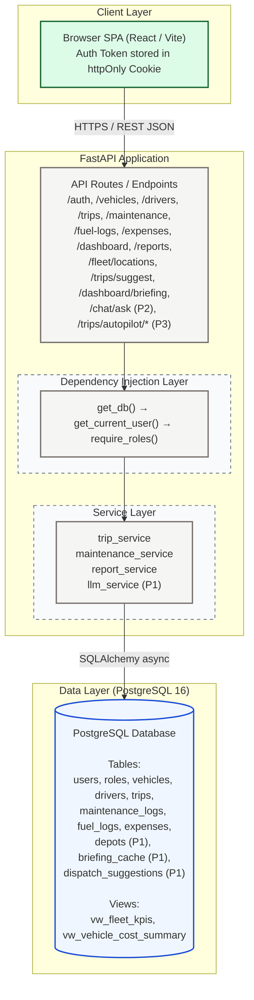

# TransitOps — System Architecture

## 1. Philosophy: Minimal Code, Maximum Value

> One language, one runtime, one database. No microservices until they're needed.

**Principle:** A single well-structured monolith is faster to build, easier to debug, and more than sufficient for hackathon + early production scale.

---

## 2. Tech Stack

### Core Backend
| Layer | Choice | Rationale |
|---|---|---|
| **Language** | Python 3.12 | Fastest iteration, rich ecosystem |
| **Framework** | FastAPI | Auto-generates OpenAPI docs, async-native, DI built-in |
| **ORM** | SQLAlchemy 2.x + Alembic | Declarative models, migration support |
| **Database** | PostgreSQL 16 | ACID, JSON support, views, triggers |
| **Auth** | `python-jose` (JWT) + `passlib` (bcrypt) | Stateless, RBAC-friendly |
| **Validation** | Pydantic v2 | Co-located with FastAPI, zero extra cost |
| **Scheduling** | APScheduler | License expiry reminders — no Celery overhead |
| **Export** | `pandas` (CSV) | Minimal deps (PDF deferred — see cut list) |
| **Testing** | `pytest` + `httpx` | Fast async test client |
| **Container** | Docker + Docker Compose | One-command startup |

### P1 — GenAI & Map
| Layer | Choice | Rationale |
|---|---|---|
| **LLM** | Any OpenAI-compatible API (e.g. Gemini, GPT-4o) | Single `llm_service` wrapper, swappable |
| **Map (FE)** | `react-leaflet` + OpenStreetMap tiles | Free, no API key, works offline |
| **Geocoding** | Static depot lookup table (hardcoded lat/lng) | No external geocoding API needed for demo |

---

## 3. High-Level Component Map



---

## 4. Project Directory Layout

```
transitops/
├── app/
│   ├── main.py                  # FastAPI app factory + lifespan
│   ├── core/
│   │   ├── config.py            # Settings via pydantic-settings (.env)
│   │   ├── security.py          # JWT encode/decode, bcrypt hashing
│   │   └── deps.py              # FastAPI Depends: db, current_user, RBAC
│   ├── db/
│   │   ├── base.py              # SQLAlchemy declarative Base
│   │   ├── session.py           # AsyncEngine + session factory
│   │   └── init_db.py           # Seed roles & default admin
│   ├── models/                  # ORM models (one file per entity)
│   │   ├── user.py
│   │   ├── vehicle.py           # includes lat, lng fields (P1)
│   │   ├── driver.py
│   │   ├── trip.py
│   │   ├── maintenance_log.py
│   │   ├── fuel_log.py
│   │   ├── expense.py
│   │   ├── depot.py             # P1 — static name→lat/lng lookup
│   │   ├── briefing_cache.py    # P1 — cached AI daily briefing
│   │   └── dispatch_suggestion.py  # P1 optional — AI suggestion log
│   ├── schemas/                 # Pydantic v2 request/response DTOs
│   │   ├── auth.py
│   │   ├── vehicle.py
│   │   ├── driver.py
│   │   ├── trip.py
│   │   ├── maintenance_log.py
│   │   ├── fuel_log.py
│   │   └── expense.py
│   ├── api/v1/
│   │   ├── router.py            # Aggregates all sub-routers
│   │   ├── auth.py
│   │   ├── dashboard.py         # includes /briefing endpoint (P1)
│   │   ├── vehicles.py
│   │   ├── drivers.py
│   │   ├── trips.py             # includes /suggest endpoint (P1)
│   │   ├── maintenance.py
│   │   ├── fuel_logs.py
│   │   ├── expenses.py
│   │   ├── reports.py
│   │   ├── fleet.py             # P1 — /fleet/locations for map
│   │   ├── chat.py              # P2 — Ask TransitOps widget
│   │   └── autopilot.py         # P3 — Control Tower
│   └── services/                # Pure business logic (no HTTP)
│       ├── trip_service.py
│       ├── maintenance_service.py
│       ├── report_service.py
│       └── llm_service.py       # P1 — single LLM wrapper, reused by all AI features
├── alembic/
│   ├── env.py
│   └── versions/
├── tests/
│   ├── conftest.py
│   ├── test_auth.py
│   ├── test_trips.py
│   └── test_maintenance.py
├── .env.example
├── docker-compose.yml
├── Dockerfile
└── requirements.txt
```

---

## 5. Authentication & RBAC

### JWT Flow
```
POST /api/v1/auth/login  →  { access_token, token_type: "bearer" }
All subsequent requests:  Authorization: Bearer <token>
```

Token payload:
```json
{ "sub": "user_id", "role": "fleet_manager", "exp": 1234567890 }
```

### Roles & Permissions Matrix

| Resource | fleet_manager | dispatcher | safety_officer | financial_analyst |
|---|:---:|:---:|:---:|:---:|
| Dashboard | ✅ | ✅ | ✅ | ✅ |
| Vehicles CRUD | ✅ | 📖 | 📖 | 📖 |
| Drivers CRUD | ✅ | 📖 | ✅ | 📖 |
| Trips create/dispatch | ✅ | ✅ | ❌ | ❌ |
| Trips view | ✅ | ✅ | ✅ | ✅ |
| Maintenance CRUD | ✅ | ❌ | ✅ | 📖 |
| Fuel Logs | ✅ | ✅ | ❌ | ✅ |
| Expenses | ✅ | ✅ | ❌ | ✅ |
| Reports & Export | ✅ | 📖 | 📖 | ✅ |

> 📖 = read-only, ✅ = full access, ❌ = no access

### RBAC Guard Pattern (FastAPI DI)
```python
# deps.py
def require_roles(*roles: str):
    def checker(user = Depends(get_current_user)):
        if user.role not in roles:
            raise HTTPException(403)
        return user
    return checker

# router usage — zero boilerplate per endpoint
@router.post("/", dependencies=[Depends(require_roles("fleet_manager", "dispatcher"))])
async def create_trip(...): ...
```

---

## 6. Key Design Decisions

### 6.1 State Machine in the Service Layer
All status transitions live exclusively in `services/` — never in routers or models. This ensures every business rule is enforced in one place.

```
Vehicle Status FSM:
  Available ──dispatch──► On Trip ──complete/cancel──► Available
  Available ──maintenance──► In Shop ──close──► Available
  Any ──retire──► Retired (terminal)

Driver Status FSM:
  Available ──dispatch──► On Trip ──complete/cancel──► Available
  Any ──suspend──► Suspended
  Suspended ──reinstate──► Available

Trip Status FSM:
  Draft ──dispatch──► Dispatched ──complete──► Completed
                              └──cancel──► Cancelled
```

### 6.2 Async SQLAlchemy 2.x
`AsyncSession` used throughout. All DB calls are `await`ed keeping the server non-blocking.

### 6.3 PostgreSQL Views for Dashboard KPIs
Heavy aggregation queries are pre-built as **database views** (`vw_fleet_kpis`, `vw_vehicle_cost_summary`). The dashboard endpoint does a single `SELECT * FROM vw_fleet_kpis` — no N+1 queries.

### 6.4 Cost Computed from Normalized Tables
Total cost = `SUM(fuel_logs.cost) + SUM(maintenance_logs.cost)` per vehicle. Never stored as a derived column — always computed fresh from normalized data.

### 6.5 Pre-flight Validation in Service Layer
Business rule violations (cargo > capacity, expired license, driver already On Trip) raise `HTTPException(422)` with structured error detail before any DB write is attempted.

---

## 7. Docker Compose (Dev)

```yaml
version: "3.9"
services:
  db:
    image: postgres:16-alpine
    environment:
      POSTGRES_DB: transitops
      POSTGRES_USER: transit
      POSTGRES_PASSWORD: secret
    ports: ["5432:5432"]
    volumes: ["pgdata:/var/lib/postgresql/data"]

  api:
    build: .
    command: uvicorn app.main:app --reload --host 0.0.0.0 --port 8000
    env_file: .env
    ports: ["8000:8000"]
    depends_on: [db]
    volumes: [".:/app"]

volumes:
  pgdata:
```

**One command to start everything:** `docker compose up --build`

---

## 8. Auto-generated API Docs

FastAPI provides interactive docs out-of-the-box:
- **Swagger UI**: `http://localhost:8000/docs`
- **ReDoc**: `http://localhost:8000/redoc`
- **OpenAPI JSON**: `http://localhost:8000/openapi.json`

---

## 9. GenAI Architecture (P1)

### LLM Service — Single Wrapper Pattern
All three AI features share one `llm_service.py`. It takes structured JSON context + a task prompt and returns structured text. Build once, reuse everywhere.

```python
# services/llm_service.py
async def call_llm(system_prompt: str, user_context: dict) -> str:
    """Single entry point for all LLM calls. Swap model by changing config."""
    response = await openai_client.chat.completions.create(
        model=settings.LLM_MODEL,  # e.g. "gpt-4o-mini" or "gemini-1.5-flash"
        messages=[
            {"role": "system", "content": system_prompt},
            {"role": "user", "content": json.dumps(user_context)},
        ],
        max_tokens=500,
    )
    return response.choices[0].message.content
```

### Feature → Endpoint → Service mapping

| Feature | Endpoint | Reuses | Cached? |
|---|---|---|---|
| AI Dispatch Advisor | `POST /trips/suggest` | Eligibility filter from `trip_service` | No (per-request) |
| AI Daily Briefing | `POST /dashboard/briefing` | `vw_fleet_kpis` + recent trips | Yes — `briefing_cache` table (TTL ~5 min) |
| Ask TransitOps (P2) | `POST /chat/ask` | Direct context stuffing from DB | No |

### Fallback Strategy
Cache one pre-generated LLM response for each AI feature (against seed data). If the live LLM call fails or times out during judging, the fallback response is returned silently — no UI hang.

### Live Fleet Map
- Library: `react-leaflet` + OpenStreetMap (free, no API key)
- Vehicle markers colour-coded: 🟢 Available · 🔵 On Trip · 🟠 In Shop · 🔴 Retired
- `Vehicle.lat` / `Vehicle.lng` = last trip's destination, or home depot if idle
- Static `depots` table maps depot names used in the mockups to hardcoded lat/lng
  - Gandhinagar Depot, Ahmedabad Hub, Vatva Industrial Area, Sanand Warehouse, Mansa, Kalol Depot
- On Trip Dispatcher: selecting Source + Destination draws a straight-line polyline and auto-fills Planned Distance (no real routing API)
- Endpoint: `GET /fleet/locations` → `[{vehicle_id, registration_number, status, lat, lng}]`

---

## 10. Explicit Cut List

> Features deliberately excluded from this hackathon build.

- ❌ Real GPS / live vehicle telemetry
- ❌ Real routing or geocoding API integration (static depot table used instead)
- ❌ Predictive maintenance via trained ML model
- ❌ Voice input
- ❌ RAG / vector DB for the chat widget (direct context stuffing only)
- ❌ PDF export (CSV is mandatory; PDF is optional and deprioritised)
- ❌ Email reminders for license expiry (bonus in spec — APScheduler log-only is sufficient)
- ❌ P3 Control Tower attempted only after P0 + P1 are fully stable with time remaining
